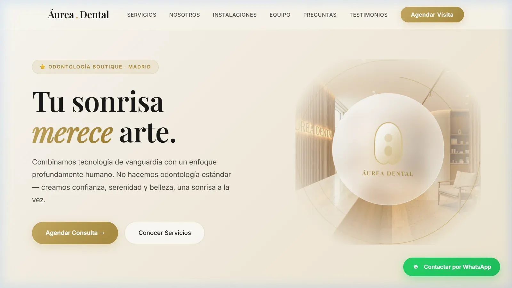

# 🦷 Áurea Dental — Odontología de Excelencia

<div align="center">
  <br>
  
  <p><em>Tu sonrisa merece arte.</em></p>
  <br>

  <p align="center">
    <a href="https://frankusqabant.github.io/aurea-dental/">
      
    </a>
    
    
    
  </p>

  <br>

  <a href="https://frankusqabant.github.io/aurea-dental/">
    
  </a>

  <br><br>
</div>

---

## 🦷 Sobre el Proyecto

**Áurea Dental** es una plataforma web profesional para una clínica odontológica premium. Diseñado con una estética refinada inspirada en el minimalismo editorial, combina tipografía clásica (*Playfair Display* + *Inter*), acentos dorados `#C6A962` y un tono cálido crema `#FAF8F4` para transmitir excelencia, confianza y calma.

> 🌐 **Sitio Web Oficial en Producción:** [https://frankusqabant.github.io/aurea-dental/](https://frankusqabant.github.io/aurea-dental/)

---

## ✨ Características Principales

- 📸 **Imágenes Ultraligeras en WebP:** Recursos locales optimizados en formato WebP (<70 KB) para tiempos de carga instantáneos sin depender de enlaces externos.
- 🎨 **Diseño Editorial & Elegante:** Paleta cromática cálida (crema, dorado y carbón), efectos glassmorphism y micro-interacciones suaves.
- 📱 **100% Responsivo & Accesible:** Menú responsive fluido, soporte para `prefers-reduced-motion` y compatibilidad universal en dispositivos móviles y de escritorio.
- 🩺 **Secciones Completas:**
  - **Hero:** Fotografía arquitectónica de la clínica, llamado a la acción y emblema dorado.
  - **Servicios:** 6 especialidades clave con tarjetas interactivas.
  - **Por Qué Áurea:** 4 pilares tecnológicos y de atención exclusiva.
  - **Galería de Instalaciones:** Gabinetes modernos y espacios de relajación.
  - **Equipo Médico:** Perfiles profesionales y dirección clínica.
  - **Testimonios 5★:** Reseñas reales de pacientes.
  - **Formulario de Contacto:** Agendamiento y consultas con confirmación interactiva.

---

## 📂 Estructura del Repositorio

```
aurea-dental/
├── imagenes/             # 📸 Galería y avatares optimizados en WebP
│   ├── hero-clinic.webp
│   ├── clinic-room-1.webp
│   ├── clinic-room-2.webp
│   ├── smile-results.webp
│   ├── doctor-carlos.webp
│   ├── doctora-elena.webp
│   ├── doctor-javier.webp
│   └── preview-aurea-dental.webp
├── index.html            # Código fuente completo (HTML5, CSS3, JS Vanilla)
└── README.md             # Documentación del proyecto
```

---

<div align="center">
  <sub>© 2026 Áurea Dental · Desarrollado por <strong>Franquer Abanto</strong></sub>
</div>